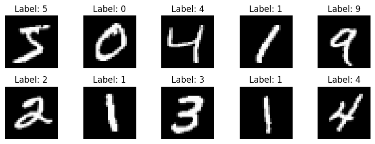
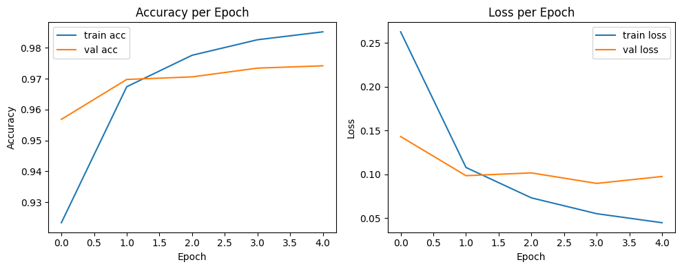
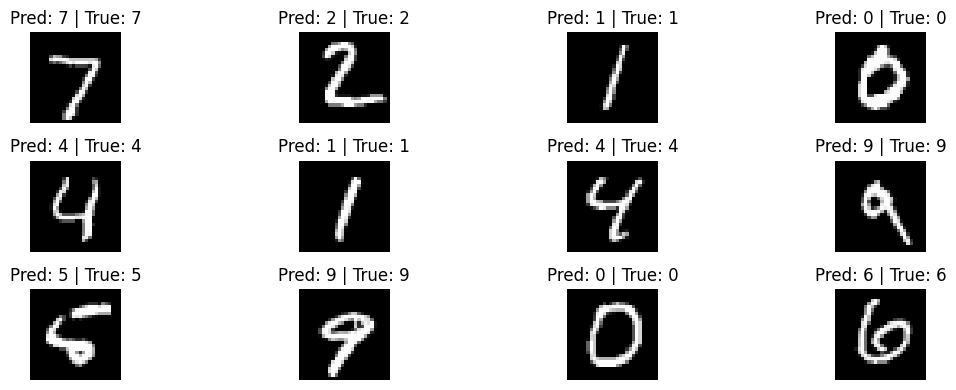
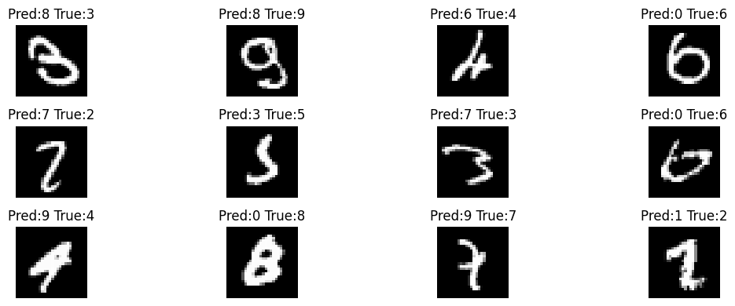
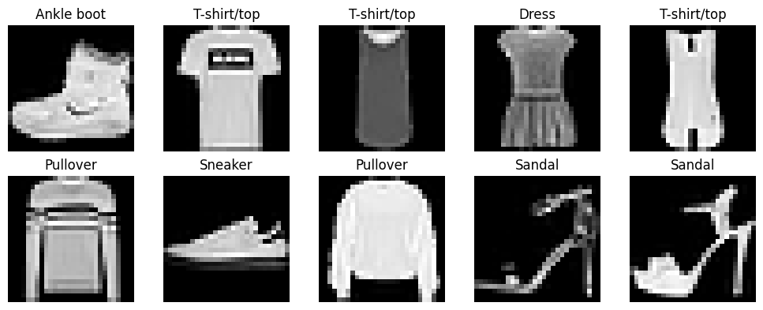
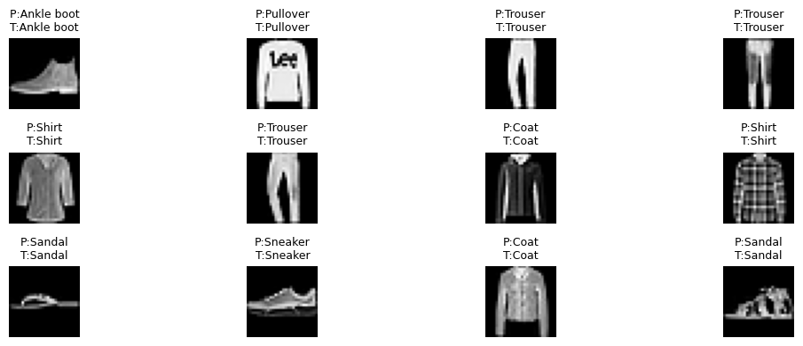

# Deep Learning: MNIST & Fashion-MNIST Neural Network

Implementasi Neural Network dasar (Dense layers) menggunakan **TensorFlow/Keras** untuk mengenali pola pada dataset **MNIST** (angka tulisan tangan) dan **Fashion-MNIST** (jenis pakaian), lengkap dengan eksperimen hyperparameter (mini challenge).

> Notebook ini bagian dari series **AI Notes & Engineering** — baca tulisan lengkapnya di [shaka-ai.hashnode.dev](https://shaka-ai.hashnode.dev)

## 📋 Ringkasan

| | |
|---|---|
| **Dataset** | MNIST (70.000 gambar 28×28) & Fashion-MNIST (10 kelas pakaian) |
| **Framework** | TensorFlow / Keras |
| **Arsitektur dasar** | `Flatten → Dense(128, relu) → Dense(64, relu) → Dense(10, softmax)` |
| **Total parameter** | 109,386 |
| **Optimizer** | Adam |
| **Loss** | Sparse Categorical Crossentropy |

## 🧠 Alur Notebook

1. Load & visualisasi dataset MNIST
2. Normalisasi pixel (0–255 → 0–1)
3. Build model Sequential (Dense layers)
4. Compile & training (5 epoch)
5. Plot accuracy/loss per epoch
6. Evaluasi di test set ("ujian akhir")
7. Visualisasi prediksi benar & salah
8. **Level Up**: ulangi seluruh proses untuk Fashion-MNIST
9. **Mini Challenge**: eksperimen mengubah jumlah neuron, jumlah layer, dan jumlah epoch

## ✅ Hasil Terverifikasi (dijalankan penuh di Google Colab)

| Eksperimen | Arsitektur | Epoch | Test Accuracy | Test Loss |
|---|---|---|---|---|
| Baseline (MNIST) | 128 → 64 → 10 | 5 | **97.39%** | 0.0899 |
| Fashion-MNIST | 128 → 64 → 10 (sama) | 5 | **87.30%** | 0.3463 |
| Challenge 1 — lebih lebar | 256 → 64 → 10 | 5 | **97.76%** | – |
| Challenge 2 — lebih dalam | 128 → 64 → 32 → 10 | 5 | **97.50%** | – |
| Challenge 3 — lebih lama | 128 → 64 → 10 | 10 | **97.66%** | – |

**Insight dari mini challenge:** menambah jumlah neuron (256) memberi peningkatan akurasi paling besar dibanding menambah layer atau menambah epoch. Pada Challenge 3 (10 epoch), val loss mulai naik-turun tidak stabil setelah epoch ke-5 sementara train loss terus turun — indikasi awal **overfitting**.

Dari 10.000 gambar test set, model baseline salah menebak **261 gambar** (≈ 2.6%).

## 📸 Dokumentasi Hasil

### 1. Sampel Dataset MNIST
Contoh 10 gambar pertama dari training set beserta labelnya.



### 2. Grafik Training (Accuracy & Loss per Epoch)
Accuracy naik dan loss turun secara konsisten selama 5 epoch — tanda training berjalan sehat tanpa overfitting parah.



### 3. Prediksi Model — 12 Gambar Pertama dari Test Set
Model memprediksi angka dari gambar yang belum pernah dilihat sebelumnya.



### 4. Saat AI Salah Menebak
Dari 10.000 gambar test, model salah menebak 261 di antaranya. Beberapa contohnya di bawah — kebanyakan memang tulisan tangan yang ambigu bahkan buat mata manusia.



### 5. Sampel Dataset Fashion-MNIST
10 kategori pakaian dengan nama kelasnya masing-masing.



### 6. Prediksi Fashion-MNIST
Model yang sama (arsitektur identik) dipakai untuk mengklasifikasi jenis pakaian — menunjukkan konsep neural network yang sama bisa dipakai lintas domain data.



## 🛠️ Cara Menjalankan

```bash
pip install -r requirements.txt
jupyter notebook Deep_Learning_Lite.ipynb
```

Atau buka langsung di [Google Colab](https://colab.research.google.com/) — tidak perlu setup GPU khusus, dataset MNIST/Fashion-MNIST cukup ringan untuk CPU.

## 📚 Sumber Materi

Notebook ini disusun berdasarkan modul **Deep Learning** dari **Full Stack Bangalore AI Engineer Bootcamp**, dengan penambahan eksperimen mandiri (mini challenge) dan verifikasi ulang seluruh output.

## 👤 Author

**Muhammad Ariel Shakaramiro**
- GitHub: [@arielshakaramiro](https://github.com/arielshakaramiro)
- Blog: [shaka-ai.hashnode.dev](https://shaka-ai.hashnode.dev)
